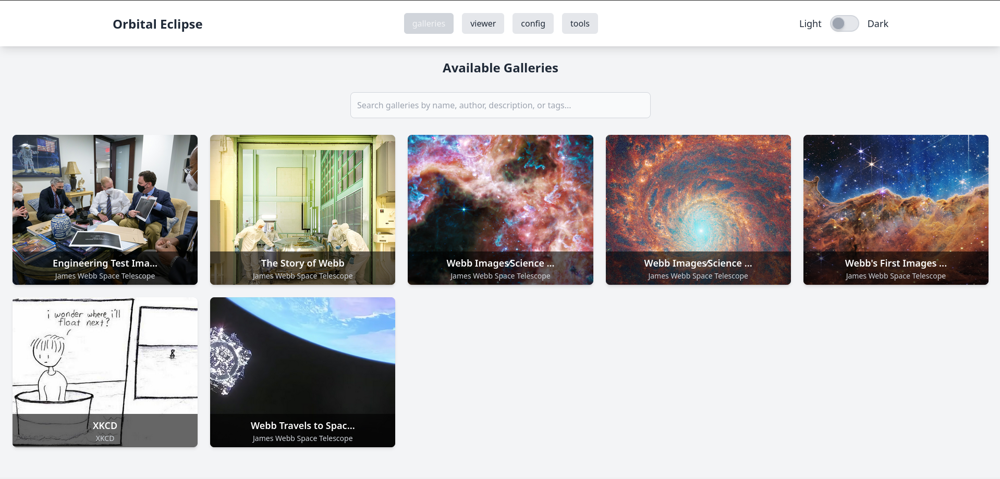
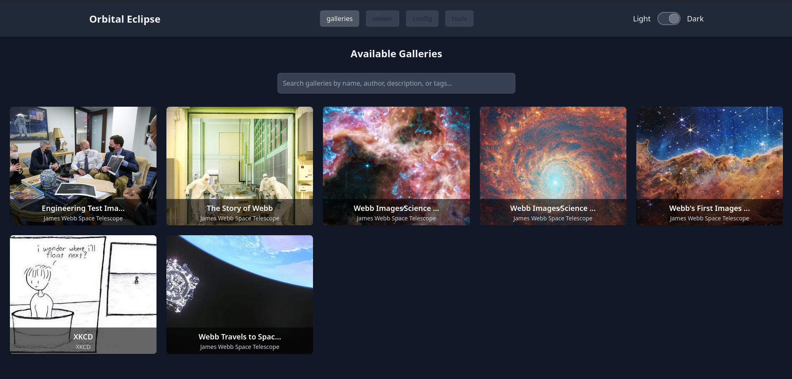

# Orbital Eclipse





**Orbital Eclipse** is a gallery viewer designed to provide a seamless and interactive experience for viewing shared image collections hosted on the InterPlanetary File System (IPFS).

Orbital Eclipse consists of two main components:

1. **Front-End Viewer**: A light-weight gallery viewer built with Svelte, providing a responsive and minimalistic interface for navigating image collections.
2. **Metadata Schema**: A flexible `metadata.json` schema that offers the necessary structure and information to display detailed attributes about the gallery, such as titles, descriptions, author information, and tags.

## Getting Started

### Prerequisites

Make sure you have the following tools installed:

- [pnpm](https://pnpm.io/installation) - A performant node package manager.

### Installation

To get started, clone the repository and install the dependencies:

```bash
pnpm i
```

### Development

To start the development server:

```bash
pnpm dev
```

### Building for Production

To create an optimized production build:

```bash
pnpm build
```

The build output will be available in the `dist` folder, ready to be served on IPFS.

## Creating a Gallery Folder

1. **Create a Root Folder**:
This folder will contain all the necessary files and images for your gallery. Example directory structure:
   ```
   my-gallery/
   ├── metadata.json
   ├── image1.png
   ├── image2.png
   ├── image3.png
   ├── cover.png
   ```

2. **Add a `metadata.json` File**:
   - In the root folder, create a file named `metadata.json`. This file is crucial as it defines the metadata schema for your gallery and should include information such as the gallery name, description, author, and a list of images.

   Example structure of `metadata.json`:

   ```json
   {
     "name": "My Gallery",
     "description": "A collection of my favorite images.",
     "author": "Artist Name",
     "creationDate": "2024-10-09T12:00:00Z",
     "coverImage": "cover.png",
     "images": [
       "image1.png",
       "image2.png",
       "image3.png"
     ],
     "tags": ["tag1", "tag2"],
     "uploader": {
       "name": "Uploader Name",
       "links": ["https://uploader.website"],
       "comment": "This gallery was created and uploaded using Orbital Eclipse."
     }
   }
   ```

3. **Configure the `metadata.json` File**:
   - Ensure that the `images` list in `metadata.json` is ordered according to how you want the images to appear in the gallery.
   - Specify the `"coverImage"` field if you want a specific image to be displayed as the gallery cover.
        - Currently, if left undefined, the first image in the `images` list will be used. 

5. **Deploy the Folder to IPFS**:
   - Once your folder is set up correctly, you can deploy it to IPFS by adding the root folder. This will make the gallery accessible through a unique IPFS hash.

## Contributing

Contributions are welcome! Feel free to open issues, submit pull requests, or suggest improvements to the schema or the front-end viewer.


